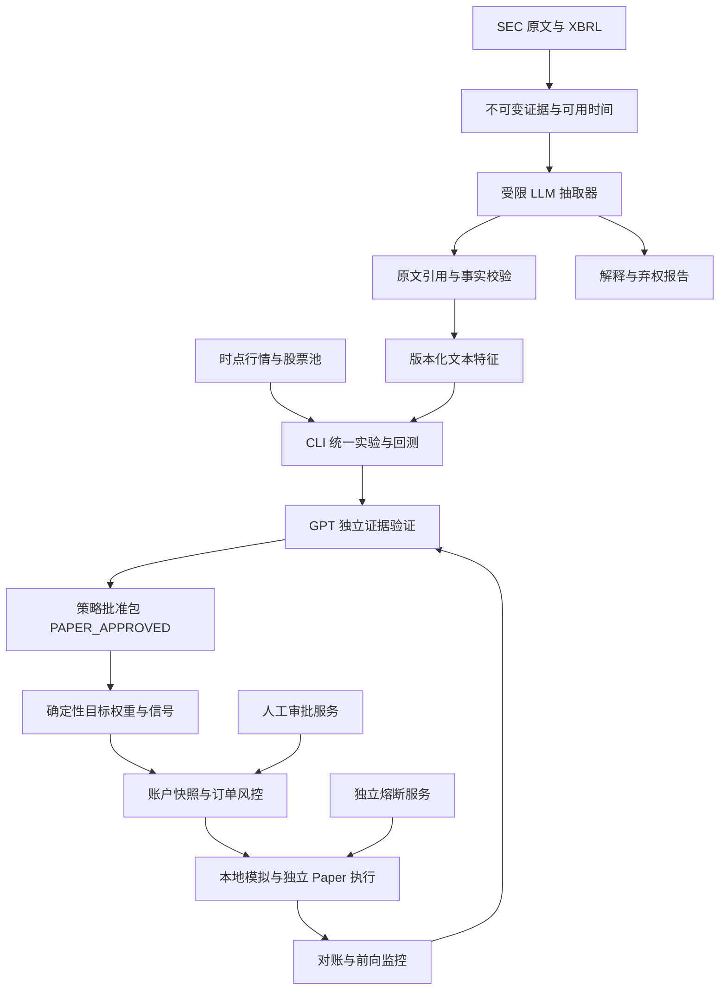

# CLI_research × gpt_quant：研发复审与大模型交易设计

更新：2026-09-06。本文是两仓下一阶段的统一设计基线；排期入口为 [PLAN](PLAN.md) 和 [GPT 开发计划](../../gpt_quant/docs/development_plan.md)。历史记录保留，不把当时完成当作当前仍有效。M8-S0R 的离线安全恢复已完成，后续共享契约发布仍未完成。

## 1. Review 结论

保留此前“CLI_research 主量化底座、gpt_quant 研究控制与治理”的方向，先完成逻辑整合，暂缓物理合仓。首个大模型 MVP 继续采用**美股 SEC 财报事件增强 Radar**，用价格规则作基准、文本特征作挑战者，验证其增量价值。

最先做的工作必须调整为**恢复合并后丢失的 M8 准入与模拟安全约束**。当前代码能解析 v4，不代表执行 v4 的安全语义；已经复现旧准入、自报天数、非有限权重、未重算信号身份、缺价消费信号和假日日历问题。现有单元测试全绿也未覆盖这些回退。

大模型可以抽取事实、提出研究假设、解释风险及生成待验证研究规格；可交易权重、订单数量、成交时点、硬风控、审批与实际执行由确定性服务决定。第一版不建设自由交易 Agent，也不同时扩展 A 股事件策略、第二套正式回测引擎、Web 平台和多个模型供应商。

## 2. 审阅基线与验证范围

| 项目 | 本轮本地基线 | 验证结果与限制 |
|---|---|---|
| CLI_research | `master@3b2cd59` | Git 跟踪的测试文件：122 passed；大量未跟踪 `* 2.py` 等副本保留、未纳入该测试范围 |
| gpt_quant | `main@f7ea460` | 工作区 111 tests OK，包含尚未提交的 `tasks.py/test_tasks.py`；两个计划文档原有修改已保留并在其基础上修订 |
| 交叉验证 | 使用 CLI `.venv/bin/python`，显式读取两仓源码 | 仅本机离线合成测试；没有安装新依赖、读取原始行情或交易明细、调用模型、连接券商或运行风控服务 |

CLI 测试使用 `git ls-files tests/test_*.py` 枚举后传给 `.venv/bin/python -B -m pytest -q -p no:cacheprovider`。GPT 使用 `PYTHONPATH=src ../CLI_research/.venv/bin/python -B -m unittest discover -s tests -q`。本机该虚拟环境不能直接 `import gpt_quant`；当前 adapter 通过源码 `PYTHONPATH` 找到兄弟仓库，因此还没有证明 wheel 安装可复现。

远端分支状态未在本轮重新联网核验。以下 Git 合并叙述来自可读任务记录和本地提交图；不能把历史“已推送”当作本轮同步结论。

## 3. 之前的 review 和合并如何纳入

### 3.1 历史决策与实际落地

| 来源 | 既有结论/动作 | 本次裁决 |
|---|---|---|
| 2026-08-28 [M7 整合计划](INTEGRATION_PLAN.md) | 主量化底座归 CLI；GPT 复用证据闸门、Agent、模拟账户；S0–S7 分阶段整合 | 保留职责；已有统一命令、Radar 与跟踪继续复用；安装依赖与契约一致性补验收 |
| 2026-08-30 [大模型行业与下一代设计](../../llm_trading_industry_nextgen_design_2026-08-30.md) | 先 Gate Hardening、正式日历，再 SEC PIT、模型抽取、A/B 与前向验证 | 保留主线；本次细化为可执行契约与门槛，不重启一份独立竞品路线 |
| “继续研究大模型交易方案” | M8-S1：CLI `a66d45c` / GPT `623f0f6`；M8-S2：CLI `b344275` / GPT `3585e8d`，历史验收通过 | 记录为历史完成；当前 GPT 已不满足关键约束，重开恢复条目，不能继续勾作整体 DONE |
| “合并 cli_research 文档分支” | `bd1d69d` 合入 `origin/master`，`dbb1c04` 整合 M7/M8；用户随后明确“保留 master” | 主线保持 `master`；历史记录称删除 main/已合并功能分支，保留独立 `codex/daily-portfolio-diagnosis`，工作区成果有 stash 和未跟踪副本；不擅自清理 |
| “合并并删除 gtp_quant 分支” | PR merge `07d8c29` 后，`ff37361` 合入 phase2；冲突文件统一保留 ours，其余新模块保留 | 这是两分支兼容性合并，并未物理合并两项目；当时 77 tests 中 1 failure/19 errors，不是有效安全准入验收 |
| 后续兼容修复与 v4 接口 | `9518854` 修复兼容 API，历史 86 tests OK；`7acb1c3` 恢复接受 v4，后续多个独立功能提交 | 兼容修复保留；当前 v4 只是字段接受与前缀检查。精确回退发生于哪一提交需恢复条目做差分定位，不能仅凭 merge 标题归因 |
| SEC 与任务模块 | GPT `05cb0e1` 存储、CLI `3b2cd59` 校验、GPT `f7ea460` 研究任务契约 | SEC 是离线契约原型；研究任务有字段校验，尚无原文引用真伪检验；后台任务 WIP 未提交，不能标为已交付 |

本轮把历史意见按“保留、部分实现、回退、延后”合并到同一验收清单。旧报告是证据来源，本文决定后续优先级；M7/M8 和 GPT Feature ID 保留，通过下文映射，避免新旧计划各跑一条开发线。

### 3.2 Review 发现（按修复优先级）

P0 表示阻断后续可执行模拟/交易准入的工程优先级，不表示已经发生实盘交易。

| ID | 级别与发现 | 当前源码证据（行号为审阅基线） | 影响与处置 |
|---|---|---|---|
| RV-01 | P0：自报准入路径回退 | GPT `src/gpt_quant/cli.py:72` 仍有 `--paper-days/--manual-review`；`cli_research.py:175` 返回 LIVE_READY；`tests/test_cli_research.py:23` 甚至期待此结果 | 合成合格研究摘要 + 70 天/true 即得到 LIVE_READY；恢复最高 PAPER_TRADING，晋级只消费独立证据与审批事件 |
| RV-02 | P0：v4 没有身份与严格数值校验 | GPT `paper.py:154` 接受 v2/v3/v4；`:186` 信任 signal_id、强转 float；`:201` 只验证哈希格式；账户不绑定策略包/日历 | 更改权重但保留 ID、NaN、bool 权重均被接受；重建严格契约，重算身份并绑定账户与策略批准 |
| RV-03 | P0：执行日历语义回退 | GPT `calendars.py:79` 用 weekday；`paper.py:226/314/353` 仍调用它；依赖表无正式日历包 | 2026-07-03 CLI 正式日历返回非交易日，GPT 接受 v4 执行与估值；消费端核对完整 calendar_id、版本、覆盖范围和实际 session |
| RV-04 | P0：缺价不原子拒绝 | GPT `paper.py:420` 先估值；`:423` 跳过缺目标价；`:441` 记录 processed ID | 空价格、目标 AAPL 的合成信号得到 0 笔订单，但信号已消费且累计 1 天；先验证全体持仓/目标报价，失败时账户、计日和消费状态全部不变 |
| RV-05 | P0：审批没有绑定风控上下文 | GPT `approval.py:40` payload 只有 intent/人/时间；`pretrade.py:60` report 无订单/账户/策略批准/政策/快照指纹 | 可用订单 A 的 APPROVED 报告为巨额订单 B 签 token；HMAC 仅解决完整性，必须增加上下文绑定、发放权限、撤销、消费幂等和发送前重校验 |
| RV-06 | P1：减仓被当成加仓 | GPT `pretrade.py:87/118` 不区分 BUY/SELL，卖出也加敞口、要求买入现金 | 有仓位、零现金的减仓 SELL 被拒，与 Kill Switch 保留减仓路径冲突；按 signed exposure 和可卖量审查，禁止超卖/反向开仓 |
| RV-07 | P1：SEC PIT 语义不足、双仓校验漂移 | GPT `sec_evidence.py:71`、CLI `contracts.py:96` 均只比较 filed_at；GPT 仅要求非空 CIK，CLI 要求数字 | 7 月 10 日回填的文本可在 7 月 2 日 as-of 查询出现。可作披露历史重建，但不能证明系统当时可用；增加可用模式、版本与事实契约，统一拒绝集 |
| RV-08 | P1：第二套正式量化路线重新膨胀 | GPT `portfolio.py` 新增组合/配置；旧 Feature 路线仍独立扩引擎、数据与策略；CLI adapter 仍依赖源码路径 | 保留兼容实现作测试基准；正式策略只用 CLI evaluator；共同 schema 和 wheel/跨仓回归优先于新增平台 |
| RV-09 | P1：DONE 与验收范围混用 | GPT F-APPROVAL-01、F-PAPER-CN-01 等勾选含尚未完成的端到端验收；F-TASK-01 未提交；README 仍描述旧准入 | 状态拆为 MODULE_DONE/INTEGRATED/FORWARD_VALIDATED/WIP/REGRESSED；测试不能替代连续运行、审批接线或安全语义验证 |
| RV-10 | P1：真实模型运行约束尚未实现 | GPT `agent/runtime.py:103` complete 无调用超时；`:116` 对所有异常立即重试；`:147` 仅响应后核费用；`research_tasks.py:42` 只检查引用字段存在 | Gateway 接入前补请求预算预留、deadline、分类退避、取消和引用重定位；结构化报告通过不等于证据有效 |

上述 RV-01–07 的关键行为已用内存/临时目录合成案例复现。RV-08–10 为源码与文档审查。R4 仍被 GPT 工具执行器拒绝；CLI 独立 `live_risk` 有单独部署和显式 live 配置，不能用 GPT 的 R4 硬锁替它背书。

## 4. 合并后的职责与发布方式

| 层 | 唯一正式职责 | 复用/新增位置 |
|---|---|---|
| 行情、股票池、特征、组合回测、实验评价 | CLI_research | 复用 `src/quant/data/`、`backtest/`、`features/`、`scanner/`、`jobs/`；新增文本特征消费和实验注册 |
| SEC 原文接入、LLM 抽取、研究工具调度 | gpt_quant | 从 `sec_evidence.py`、`models/`、`agent/` 扩展；受限工作流，不导入 CLI 引擎源码 |
| 证据准入、策略批准、订单风控/审批、模拟账本 | gpt_quant | 修复现有 `paper/approval/pretrade/orders`，形成唯一实际调用链；独立治理与研究进程权限分离 |
| 跨仓 schema、哈希、日历契约 | 独立安装包，单一源码所有者 | 拟置于 GPT 的 `packages/quant_contracts/`，独立 wheel，无 quant/gpt_quant 业务导入；两仓锁同一发布版本。正式日历 adapter 随该包固定依赖，不能仅共享字符串 |
| IBKR 账户级止损守护 | CLI 独立服务 | 继续独立 Paper 验收；它处理账户保护，不能成为 LLM 下单通道 |
| 控制台、手机入口 | 后续可选客户端 | 只调用服务 API 和读取审计，不持有券商凭据和审批签名密钥 |

依赖保持 `quant → gpt_quant 公共接口`、两者 `→ quant_contracts`，GPT 不反向 import quant。正式交互可用已安装 CLI 子进程和版本化 JSON；删除源码路径依赖应通过 wheel 安装回归，不能只移除 PYTHONPATH。

物理合仓延后至跨仓契约/日历/端到端回归稳定后。届时保留 `quant`、`gpt_quant` 命名空间与旧命令；先生成迁移清单、数据路径映射、安装检查及回滚方案，再单独执行迁移。当前不复制一套继续开发的源码，不删除原仓库、stash 或 ` 2` 副本。

每次跨仓发布必须记录 `cli_sha + gpt_sha + contracts_version + calendar_id + lockfile_hash + fixture_hash + test_report`。对严格信号、假日、旧 schema、篡改、NaN、缺价、撤销批准和重启重放执行双向反例测试。冲突逐文件按安全不变量处理，禁止整批 ours/theirs 作为验收；测试未通过不发布，功能分支在目标 SHA 验证后才清理。物理合并提交不等于语义整合。

## 5. 大模型交易的目标链路

下图均为目标设计；实线也不意味着当前全部接通。

日常两条路径：研究助手把自然语言变成 `ResearchSpec` 并调用已注册工具；事件抽取器只把受信任检索器提供的 SEC 文本转为 `llm_feature`。均无订单工具、任意 shell、写风控配置或读取券商密钥权限。研究产物通过独立验证后，已批准策略才可由确定性代码产生 paper target。

LLM 不在订单发送/撤单/止损的必经路径。模型故障时，尚未批准的 challenger 信号不产生；已批准的价格基准仅在预先冻结的 fallback policy 允许时继续。已有仓位的估值、风险控制、退出和对账持续运行，不能等待模型恢复。

## 6. 契约与时间设计

### 6.1 SEC：区分披露时间、系统知道的时间与特征就绪时间

`SecEvidence v1` 保留作离线原型，生产研究路径升级为 v2。最低新增字段：`document_version_id`、`accession`、历史 issuer/instrument 映射、`accepted_at`、`published_at`（可未知）、`first_received_at`、`validated_at`、`available_at`、原始字节哈希、标准化文本哈希、parser 版本、`supersedes`、来源/许可、`availability_mode`、时间精度和缺失原因。

- `observed` 前向模式：`available_at = max(可靠披露/接受时间, first_received_at, validated_at)`；只用 `available_at <= decision_at` 的版本。重复抓取追加 observation，不能把 first_received_at 改早或用抓取时间生成另一份相同文档身份。
- `historical_reconstructed` 历史模式：保留有来源的披露时间和冻结的分发/处理延迟假设；历史回填发生在今天不意味着历史不能研究，但必须标注为重建证据，不能累计前向天数，不能混入 observed 结果。
- `feature_ready_at` 为抽取与校验完成时间。交易信号必须等待所用特征就绪；历史实验用冻结的模拟延迟，不拿今天抽取完成时间冒充历史实测。
- 同 accession 多个主文档/附件由文件路径与内容哈希区别；修订使用新版本与关联边，重述财务数据不得覆盖旧 as-of 视图。
- XBRL 事实绑定 `taxonomy/tag/unit/period_start/period_end/dimensions/accession/decimals`；季度与累计、币种、每股与总额必须区分。数值、同比和 surprise 由确定性工具计算；没有当时一致预期数据时不生成“超预期幅度”。

SEC 官方说明 API 在披露后继续处理，submissions 与 XBRL 的延迟不同，峰值期间可能更长；`frames` 选择最近申报的匹配事实，不能直接把今天聚合结果当作历史快照。[SEC EDGAR API](https://www.sec.gov/search-filings/edgar-application-programming-interfaces)

### 6.2 对象、身份和迁移

| 对象 | 最低身份与绑定 | 失败处理 |
|---|---|---|
| `ModelRun v1` | provider、实际返回模型标识、可用的固定版本/截止信息、prompt/tool schema、输入输出哈希、usage、请求 ID、重试、开始/完成时间 | 不知道模型截止日就明确 unknown；动态别名变化视为新版本；远程推理不能保证逐字复现，保存响应供重放 |
| `LLMFeature v1` | 文档版本、事件、标的、期限、事实引用、方向/幅度类别、abstain/reason、模型运行、extractor/schema、ready_at、TTL | 引用不存在、实体/期间/单位冲突、超时、低可靠性或过期 → invalid/abstain，不能填零冒充中性 |
| `ExperimentManifest v1` | 假设、股票池快照、特征、标签、成本、成交规则、split、试验预算、成功/失败门槛、baseline、所有 trial | canonical hash 生成 experiment_id；任何变更另开实验，失败 trial 也登记 |
| `EvidenceBundle v1` | manifest、代码/数据/模型/契约/日历版本、逐折结果、最终测试使用记录、成本容量、反证和前向轨迹 | 复算身份、校验完整性和时点性；历史重建与真实前向分开 |
| `StrategyApproval v1` | evidence hash、策略包、允许市场/股票池/特征版本/风险政策、PAPER_ONLY 范围、审批者、签名、有效期、撤销记录 | 批准签发进程与模型隔离；任一版本变化或撤销失效 |
| `PaperTargetSignal` | 保留并先恢复 v4；后续 v5 显式加入 StrategyApproval ID、父特征快照、业务键、revision、生成/可用/过期时间、完整日历身份 | producer/consumer 共用 canonical 编码；ID 重算；旧版只能显式导入历史视图，不能静默用于新执行 |
| `RiskDecision v1` | intent hash、account_id、position/cash/quote snapshot、policy、StrategyApproval、检查项、issued/expires_at | 风控对当前状态重算；市场/行情/仓位或审批变化需重新审查 |
| `OrderApproval v2` | RiskDecision hash、intent hash、账户、策略批准、操作者身份、nonce、有效期、撤销版本 | 签名有效仍需校验绑定和授权；按订单业务键幂等消费；不能重用别的订单的 APPROVED 报告 |

策略批准不能预先绑定尚未产生的未来行情哈希。它批准策略版本及可用数据约束；每次运行的特征、行情和账户快照由 Signal/RiskDecision 逐次绑定，从而避免把长期策略批准与单次订单审批混成一个 token。

统一规范必须定义：UTC 归一化、字符串/数字严格类型、禁止 bool 冒充数字及 NaN/Inf、字典排序、列表业务顺序、金额定点精度、权重精度、schema 拒绝未知字段规则，以及哪些时间属于内容身份。普通 SHA 只能校验内容一致性，不能证明来源或批准权限。

## 7. 模型运行、质量与风险边界

第一版一个 provider adapter，选择时优先考虑结构化输出、固定版本、可观测 usage、超时/取消、总成本与本机可接入性。接口和离线 fixture 可以先开发；真实调用需要可用服务配置与预算，不能把所有本地工作都标为“等账号”。

请求前预留最大输出对应预算，设置单文档、单任务、日累计上限与截止时间；usage 缺失按保守上限核算。仅对可重试的限流/服务错误做有界退避，认证失败与 schema 错误直接失败；重试费用纳入同一预算。超时或取消后不把迟到响应发布为有效特征。缓存键包含完整文档/模型/prompt/schema/参数版本；同名模型切换不得命中旧缓存。

外部文档是待分析数据，不能改变系统指令。允许的 URL/文件由检索器生成，阻止模型自造路径或跳转内网；抽取器无凭据、shell、任意网络和交易权限。原文引用必须携带 document hash、标准化文本 offset 与 quote hash，并能重新定位。结构合法但原文不支持的数值/观点要拒绝；研究助手的自然语言结论和确定性事实字段分开存储。

初始验收门槛（本项目拟定，先冻结后评估）：至少 200 个按发行人和时间隔离的人工标注事件；接受样本的引用定位 100%，关键数值/期间/币种一致率至少 99%，事件分类 macro-F1 至少 0.85；同时报告逐类样本量和置信区间。记录 coverage/abstention，预登记最低覆盖率，不能靠全部弃权获得高准确率。先在开发集确定弃权阈值，测试集不得调阈值。

模型自报 confidence 不是上涨概率，不直接放大仓位；使用标注验证得到的可靠性分桶作为过滤因素，最终仓位受独立上限、流动性和相关性约束。模型差异/重试不一致要记录，不用多 Agent 投票替代证据与统计检验。

## 8. 首个 MVP 与实验设计

范围：固定且有历史成员证据的美股池，8-K 财报公告、10-Q/10-K；日频、长仓、无杠杆。优先抽取业绩指引上调/下调/撤回、管理层风险变化、与上次披露相比的新信息；数值财务指标交给 XBRL 解析。没有 PIT 股票池的存量自选池仅作覆盖受限探索。

| 对照 | 内容 | 回答的问题 |
|---|---|---|
| B0 | Cash、SPY/适当基准、Buy & Hold | 有无绝对/相对价值 |
| B1 champion | 现有价格/量能 Radar，冻结规则与持有期 | 已有系统表现 |
| B2 | B1 + 确定性 XBRL/关键词事件字段 | 增量是否仅来自接入更多数据 |
| B3 challenger | B2 + 经引用验证的 LLM 文本特征 | LLM 是否提供独立增量 |
| N1/N2 负对照 | 文本特征按发行人/日期分组置乱、删除文本或匿名化实体实验 | 是否存在泄漏、文本无效、实体记忆干扰 |

各组使用同一时点股票池、行情版本、费用、资金约束、再平衡时刻、执行延迟和评价器；主比较 B3−B2，辅比较 B3−B1。主要持有期预登记为 5 个交易日；1/3/10/20 日只作次级统计并校正多重比较，不能事后挑最好期限。

训练/验证/最终测试严格按时间顺序；沿用 CLI 三段式与逐折训练选参。对重叠持有期的标签增加 purge/embargo，同发行人相关公告成组处理。冻结 prompt、模型、特征、阈值、最大 trial 数和成本假设后才打开最终测试；所有 prompt/模型/参数尝试计入研究预算，不能另建 study 文件重新使用同一终测。

评价包括含交易成本和模型费用的组合净收益、B3−B2 增量、回撤、换手、尾部亏损、行业集中、容量、coverage、失败/弃权率和延迟。置信区间按发行人/日期聚类或区块 bootstrap，不把重叠事件当独立交易。费用还需包含买卖价差与延迟压力情景；无盘口时说明估计来源，不宣称验证了市场冲击。

统计晋级门槛在 M8-S4 开始前由实验 manifest 冻结：主比较增量净收益的 95% 区间下界大于 0，预登记成本压力情景后增量仍为正，回撤与集中度不超过批准政策，独立事件量达到预先功效分析要求。样本不足、功效不足或区间跨 0 返回 INCONCLUSIVE，继续前向收集，不能宣称“有效策略”。不强行沿用通用 50 笔交易等门槛替代事件策略的样本分析。

PIT 检索无法消除模型预训练已经见过未来结果的风险。记录模型版本/已知截止信息，未知则历史结果仅列为探索；匿名化和负对照只能检测部分偏差。最终依赖冻结后真实前向样本，不能凭“提示模型假装回到过去”获得无泄漏标签。[Glasserman 与 Lin：LLM 回测中的前视偏差](https://arxiv.org/abs/2309.17322)

## 9. 策略批准、订单状态与运行恢复

晋级链为 `DRAFT → DATA_VALID → RESEARCH_VALID → FINAL_TEST_PASSED → PAPER_APPROVED → SHADOW/PAPER → FORWARD_REVIEW`；失败/样本不足/撤销各有显式状态。研究审批只赋予 PAPER_ONLY 范围；实盘为未来独立准入任务，R4 当前持续硬锁。

发送路径为 `target → OrderIntent → RiskDecision → OrderApproval → durable outbox → broker adapter → fills → ledger/reconciliation`。本地 Paper 与订单状态机接通前不能把分散模块的 DONE 相加当作完整执行系统。

- 发送前重查账户、仓位、可卖数量、现金及未成交订单预留、报价时效、策略批准/令牌撤销、市场与品种规则。SELL 用减仓后的敞口，任何超卖或由平仓变开仓都拒绝。
- 订单业务键包含 account/strategy/signal/revision/leg，跨重启稳定。`SUBMITTING` 超时后进入 `UNKNOWN/RECONCILING`，查询券商状态后再决定；不自动生成新 ID 重发。
- 订单事件与消费信号状态必须在事务边界中提交；执行发送与本地数据库不能假设分布式 exactly-once，用 outbox、券商键和对账实现去重恢复。重复/乱序成交回报按 execution ID 去重，支持部分成交、撤单竞态、改单及剩余资金预留。
- 启动先核对现金、持仓、未结订单、最近成交与账本；任何差异阻断新增风险，并保留可验证减仓/撤单能力。断电、中途写入、磁盘满、重复进程、数据库锁等作为故障注入验收。
- 账户日损按冻结时区/交易日和外部资金流调整后的基线计算；个股/行业/总敞口及策略之间资金竞争统一由账户风控裁定，LLM 不能修改阈值。

前向阶段至少覆盖 63 个真实交易会话，并达到预登记独立事件量；空跑/回填/重复估值不得制造天数。至少记录每日证据和特征版本、计划/实际信号、成交偏差、成本、对账差异、熔断/恢复、模型版本漂移与缺失样本。测试门槛是 0 次重复执行、0 次未授权订单、0 个未解释对账差异；可用率、延迟与亏损阈值需预登记，失败立即停止新增风险。

本地模拟用于确定性一致性；券商 Paper 用于连接和恢复验收；二者都不能证明真实成交质量。IBKR 说明 Paper 由盘口顶部模拟成交，缺少深度盘口，部分订单行为也不同。[IBKR Paper 限制](https://www.ibkrguides.com/brokerportal/aboutpapertradingaccounts.htm)

## 10. 新的实施顺序与验收门槛

估算为净开发工作日，不含账号接通、数据取得和真实前向等待；前置失败则顺延，不以日期或代码数量强行完结。

| 条目 | 状态/优先级 | 负责人模块与交付 | 完成条件 | 估算 |
|---|---|---|---|---|
| M8-S0R | DONE / P0 | GPT 消费端；恢复 M8-S1/S2 安全语义、RV-01–04 | 自报只能 PAPER、v2/v3 拒绝新执行、篡改/NaN/bool/缺价原子拒绝、假日/提前收市/日历漂移拒绝；GPT 111 tests 通过，详见 GPT 验收记录 | 完成 |
| M8-S3a | OFFLINE DONE / P1，依赖 S0R | GPT 维护 shared contracts wheel；两仓锁版本，canonical/schema/hash/calendar 基础已具备 | wheel 已生成并在全新临时环境无 PYTHONPATH 安装/导入通过；两仓完整发布矩阵与 golden fixture CI 仍需目标环境复核 | 完成 |
| M8-S3b | OFFLINE DONE / P1，依赖 S3a | GPT SEC v2/事实/修订存储；CLI 校验消费 | observed 与 reconstructed 分开；迟到/修订/版本哈希/as-of 反例通过；真实 provider 待接入 | 完成 |
| M8-S3c | OFFLINE DONE / P1，依赖 S3a | GPT RiskDecision、StrategyApproval、OrderApproval | 跨 intent/账户报告不可复用，过期/篡改阻断；签名上下文绑定；真实签发权限和券商减仓待验收 | 完成 |
| M8-S4a | OFFLINE DONE / P1，依赖 S3b | GPT 受限特征抽取、引用/预算/超时/注入防护 | 引用可重定位、弃权和过期拒绝、预算/注入测试通过；真实 provider 与标注集待验收 | 完成 |
| M8-S4b | OFFLINE PARTIAL / P1，依赖 S4a | CLI 实验注册已增加 manifest/trial ledger；B0–B3/负对照/统计终测仍待开发 | trial 预算、冻结和 final test 单次消费已可验收；完整对照、成本/容量和置信区间仍需实现 | 5–8 日 |
| M8-S5a | OFFLINE DONE / P1，依赖 S3c 及合格研究证据 | GPT Paper 执行桥、审批/outbox 对接 | 审批后执行、缺价/重放/撤销拒绝、JSONL 重启幂等；部分成交、券商断线和真实对账待验收 | 完成 |
| M8-S5b | PLANNED，依赖 S5a | shadow + 本地 paper；IBKR Paper 连接为独立适配验收 | 至少 63 个真实会话 + 独立事件量门槛 + 每日对账；模型漂移触发新版本评估 | 日历时间约一季度或更长 |
| M6-S3 | PARTIAL，独立轨道 | CLI IBKR 账户级止损守护连续 Paper 验收 | 既有仿真不能替代真实 Paper 连接、夜间恢复、通知和账户身份核验 | 独立排期 |
| M7-S9 / API/UI/新引擎/更多策略 | DEFERRED | 根据前向结果决定物理合仓和产品化 | 存在已验证用户需求与量化价值后再立项；F-TASK WIP 可先独立保全/收尾 | 不占关键路径 |

下一次具体开工条目是 **M8-S3a**。M8-S0R 已恢复现有边界内的安全语义；先完成共享契约 wheel、固定日历依赖和干净安装回归，再接真实模型。F-ORDER/F-RISK/F-APPROVAL/F-KILL 对应 S3c/S5a，F-MODEL 对应 S4a，F-EXP/F-REPORT 对应 S4b；已有配置/策略模块只保留兼容，不再开启第二套正式 evaluator。

## 11. 验收记录模板

每一条必须保存：目标 ID、修改范围、两仓 SHA 与工作区状态、契约/日历版本、正反例结果、安装/跨仓验证、已知局限、准入结论、回滚到哪一版本。DONE 表示该条明确边界内完成；模块完成、端到端接通、真实前向验证分别记录，未提交成果标 WIP。

模型配置、实际 API 预算、行情许可/覆盖与券商 Paper 身份是连接阶段待落实信息；不妨碍先完成离线契约、恢复测试、抓取器 fixture 和设计实现。业务交易授权只能由未来执行流程单独取得，不能从本次研发 review 推导。
