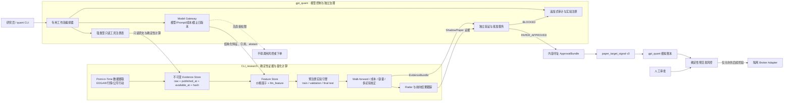
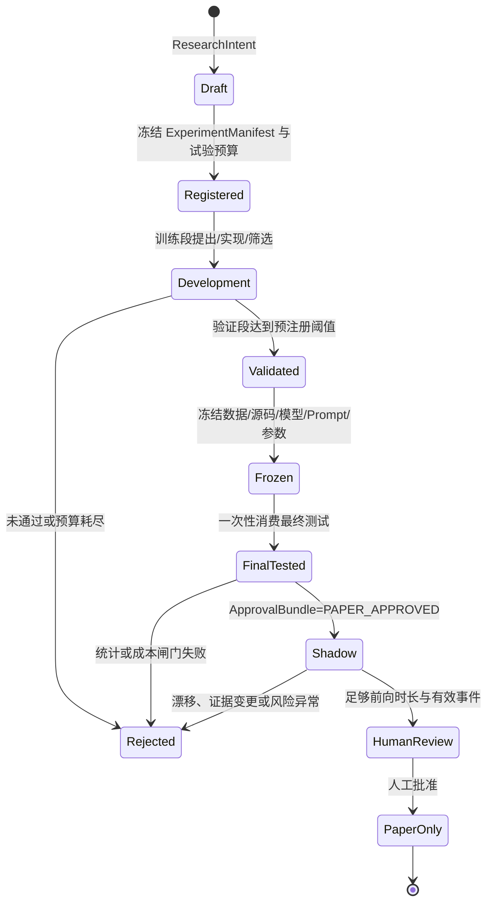

# 大模型参与交易：业界有效方法与下一代量化研究系统设计

> 2026-09-05 更新说明：本文保留当时研究与代码审计快照。两仓后续开发和分支合并已发生变化，当前研发顺序、回退问题、共享契约、LLM 实验及交易链设计以 [统一复审与设计](CLI_research/docs/LLM_TRADING_DESIGN.md) 为准；本文历史完成状态和 v3 草案不可直接用作当前执行契约。

> 调研与本地代码审计日期：2026-08-30  
> 对象：`/Users/brucehuang/Documents/CLI_research` 与 `/Users/brucehuang/Documents/gpt_quant`  
> 结论范围：量化研究、信号验证、模拟交易与受控执行架构；不构成投资建议或收益承诺。

## 1. 执行结论

当前最有效、也最接近机构实践的方案，不是让大模型直接预测价格并下单，而是把大模型放在两个位置：

1. **非结构化信息编译器**：把公告、财报、电话会、新闻和研究材料转换为带来源引用的结构化事件、情绪、预期差和风险特征，再交给传统统计模型、组合优化器和回测引擎。
2. **量化研发代理**：提出可证伪假设、生成受限代码、并行探索候选因子；所有实验由确定性引擎运行，最终由独立统计闸门和人工审批决定是否进入模拟观察。

公开证据对“提高研究吞吐”和“文本结构化”最强；对“可持续、扣费后的交易 alpha”只有有限的样本外证据；对“LLM 直接自主交易或盘中执行”仍缺少可信的公开生产证据。Man Group 已公开其 AlphaGPT/AlphaTrend 研发流程，但仍保留人工监督和与人工研究相同的上线标准；J.P. Morgan Asset Management 则明确说明 LLM 不负责最终投资决定。[Man Group AlphaGPT](https://www.man.com/insights/what-ai-can-do-for-alpha)、[Man Group AlphaTrend](https://www.man.com/insights/alphatrend-agentic-research-workflows)、[J.P. Morgan Asset Management](https://am.jpmorgan.com/content/dam/jpm-am-aem/americas/us/en/smas/presentation-usv-ma.pdf)

对现有两个项目，建议的下一代方向是：

> **把系统升级为“Point-in-Time Evidence & Experiment OS（时点证据与实验操作系统）”，而不是“LLM Trader”。**

最合适的首个闭环是“**美股 SEC 公告/财报事件特征增强 Radar**”：用 `gpt_quant` 做受限模型编排和结构化抽取，用 `CLI_research` 做时点数据、特征、回测、Radar A/B、独立最终测试和前向跟踪。LLM 不产生订单，只生成可验证的 `llm_feature`；只有通过确定性闸门的策略版本才能进入现有模拟账本。

在接真实模型前，必须先修复当前准入与信号绑定的 P0 缺口：自报 paper 天数、证据哈希未复核、信号未绑定策略/数据版本、非有限权重和目标价格覆盖不完整等。否则，增加 LLM 只会放大现有证据漂移面。

## 2. “有效”的定义与证据等级

本报告把“有效”拆成三种不同目标，避免把效率提升误称为交易收益：

| 目标 | 衡量方式 | 当前公开证据 |
|---|---|---|
| 研发效率 | 可验证假设数、实现时间、失败率、研究成本 | 强 |
| 信息处理质量 | 抽取 F1、引用覆盖、校准、对事件反应/收益的增量解释力 | 中到强 |
| 可交易 alpha | 严格时点样本外、扣成本收益、容量、跨市场/跨模型稳定性 | 有限 |

证据分级：

- **A级**：机构公开使用或实时/真正样本外验证，且说明了运行边界。
- **B级**：论文有后训练截止日样本、walk-forward 或可复现代码，但尚非公开生产 PnL。
- **C级**：历史回测、少量标的或单一市场实验，容易受训练泄漏、参数搜索和成本假设影响。

## 3. 业界方案全景与优劣

| 方法 | LLM 的角色 | 公开证据 | 优点 | 主要缺点 | 建议 |
|---|---|---|---|---|---|
| 研究 Copilot / Agentic Alpha Factory | 假设、代码、实验反馈 | **A（效率）/B（收益）**。Man AlphaGPT/AlphaTrend；微软 RD-Agent(Q) | 大幅提高候选覆盖和实现速度；适合复用内部研究库 | 多重试验、代码错误、回测过拟合；收益归因难 | **优先采用**，但必须预注册预算、独立最终测试 |
| 文档抽取与事件标准化 | 公告/财报/条款 → 结构化字段 | **A（流程）**。Man 用于巨灾债条款抽取；JPM 用于研究助手/主题搜索增强 | 价值清楚、可人工抽查、延迟要求低 | 摘要会丢上下文或注入内容；需要许可和时点元数据 | **最适合作为首个生产用例** |
| 文本特征 + 传统模型/组合 | 情绪、事件、embedding、预期差特征 | **B**。新闻流微调、JFE 2026 新闻标题研究 | LLM 擅长文本，数值预测与组合仍可校准、回测和约束 | 数据昂贵；alpha 衰减；小盘容量和交易成本敏感 | **优先做 A/B challenger** |
| 数值模型触发 + LLM 解释 | 数值模型发现异常，LLM 找新闻和解释 | **A/B（监控）**。BIS 的 RNN + LLM 两阶段市场监控 | 把 LLM 放在最擅长的语义层；易审计 | 解释不等于预测；可能产生事后叙事 | **适合 Radar 原因归因与风险监控** |
| 多代理辩论、记忆、自我反思 | 多角色直接给交易动作 | **C**。FinMem、FinCon、TradingAgents | 能融合多源信息，交互形式直观 | 角色相关性高，不等于独立证据；提示/模型漂移；实验市场窄 | 仅作研究对照，不作准入核心 |
| LLM 直接择时、仓位和执行 | 端到端交易决策 | **C/缺少生产证据** | 原型快、演示性强 | 延迟、成本、不可复现、幻觉、校准差、无法硬约束 | **禁止进入热路径** |

具体的机构用法也遵循这一边界：Man Group 公开的是文档抽取、研究代码和信号研发工作流；J.P. Morgan 在 Quest 主题指数中披露的 LLM 增强是改进“公司—主题”检索词，而不是让模型自由决定仓位。[Man Group 的四类 GenAI 用法](https://www.man.com/insights/AI-asset-management-lightbulb-moment)、[J.P. Morgan QIS/LLM 讨论](https://www.jpmorgan.com/insights/podcast-hub/making-sense/equities-quantitative-investment-strategies)

### 3.1 量化研发代理：目前最成熟的价值点

Man Group 披露的 AlphaGPT 将流程拆成“想法—实现—评估”，AI 生成的信号必须通过与人工研究相同的经济逻辑、统计、风险和代码审查；其 2026 年 AlphaTrend 进一步采用预定义、可并行、可复现、可审计的专用工作流，而不是一个无限开放的聊天代理。[AlphaGPT](https://www.man.com/insights/what-ai-can-do-for-alpha)、[AlphaTrend](https://www.man.com/insights/alphatrend-agentic-research-workflows)

微软的 [R&D-Agent-Quant（NeurIPS 2025）](https://arxiv.org/abs/2505.15155) 用研究、开发和反馈循环联合优化因子与模型，论文报告相对经典因子库最高约 2 倍年化收益、因子数减少 70%。这是值得复现的开放基准，但仍属于特定数据、回测和实验设置，不能直接外推为生产收益。

Alpha-GPT 的早期工作采用“自然语言想法 → alpha 表达式 → 算法搜索 → 解释”的人机闭环，也印证了大模型更适合做研究意图和确定性搜索之间的编译层。[Alpha-GPT 论文](https://arxiv.org/abs/2308.00016)

### 3.2 文本事件与情绪信号：最有希望的直接 alpha 路径

即将刊于 2026 年 10 月 JFE 的研究使用模型知识截止日之后的新闻标题，发现 GPT-4 能很好地解释不可交易的即时市场反应，并对后续漂移有增量预测；论文报告的次日漂移多空组合年化 Sharpe 为 2.97，效果在小盘股和负面新闻更强，同时随着 LLM 普及而衰减。[JFE 论文页面](https://www.sciencedirect.com/science/article/pii/S0304405X26001066)

这项结果的重要限制是：约 90% 的方向命中率对应已经发生、不可交易的即时反应；真正可交易的是更弱的后续漂移，而且小盘、负面事件也最容易受到点差、借券、容量和新闻时间戳误差影响。

另一条更稳健的路线是把 token embedding 或结构化文本标签作为输入，再用受监督模型做收益预测；公开研究发现这种表示一般能改善多空或多头组合，但在较小股票池中没有稳定赢家。[新闻流微调研究](https://arxiv.org/abs/2407.18103)

2026 年的 NBER 实时样本外基准让 agent 从财报电话会抽取结构化信号并优化，最优系统把公告窗口收益的解释度从约 8% 提升到接近 20%。这证明 agent 能提高事件解释力，但指标是**同期解释度**，不是未来可交易收益。[NBER Working Paper 35431](https://www.nber.org/papers/w35431)

### 3.3 多代理直接交易：有启发，证据等级仍低

[FinMem](https://arxiv.org/abs/2311.13743) 使用分层记忆，[FinCon](https://arxiv.org/abs/2407.06567) 使用经理—分析师层级和语言强化，[TradingAgents](https://arxiv.org/abs/2412.20138) 使用基本面、情绪、技术、牛熊和风险角色。它们在各自回测中报告优于基线，但常见限制包括：少量高新闻覆盖标的、短测试期、同一底模造成的相关判断、提示和模型版本不可复现，以及对训练语料时间边界交代不足。

这些框架适合借鉴“角色隔离、记忆时效和反方审查”，不应把“多个 agent 同意”当成统计显著性或风险批准。

## 4. 反例与失败模式

1. **训练语料泄漏。** 2026 年 Annual Review 的计量框架测试 2019 年新闻标题时，GPT-4o 能逐字补全部分公开标题；相关研究还发现 Llama 2 在 2019 年电话会风险预测中提前提到 COVID-19。历史回测若不知道精确训练语料，就不能证明时点样本外。[Large Language Models: An Applied Econometric Framework](https://doi.org/10.1146/annurev-economics-120925-105620)
2. **摘要改变决策。** 2026 年研究发现，流畅且事实表面正确的财务摘要仍可能因为去语境化而改变下游投资判断；多候选压缩并回到原文审计能缓解但不能消除。[When Summaries Distort Decisions](https://arxiv.org/abs/2606.29251)
3. **LLM 特征存在系统测量误差。** 对 S&P 500 披露的研究发现，LLM 既会遗漏有意义术语，也会注入原文没有的概念；长文本构念评分最严重，直接、窄定义的 prompt 较轻。[LLMs and Systematic Measurement Error](https://papers.ssrn.com/sol3/papers.cfm?abstract_id=7177500)
4. **人类式外推和过度乐观。** LLM 对历史股票收益的预测会过度外推近期表现，且相对未来实现收益偏乐观。[Extrapolation and Miscalibration](https://arxiv.org/abs/2409.11540)
5. **共同模型造成拥挤与同质化。** BIS 2026 年 Project Logos 专门研究 LLM 组合经理是否放大相关配置和市场波动，说明这一风险尚处于监管探索期，而非已经解决。[BIS Project Logos](https://www.bis.org/about/bisih/topics/suptech_regtech/logos.htm)
6. **解释可能只是事后叙事。** BIS 更审慎的做法是先让 RNN 从一百多个数值指标预测市场压力，再让 LLM 根据已识别的关键变量检索新闻并解释，而不是让 LLM 自己同时预测和证明。[BIS 两阶段监控](https://www.bis.org/publ/work1291.htm)

## 5. 现有系统审计

### 5.1 当前能力定位

`CLI_research` 已是主要确定性量化底座，不只是研究 CLI；`gpt_quant` 是独立证据验证器、本地模拟账本和 Agent 骨架，而不是真实模型或成熟交易系统。

| 层 | 现有能力 | 判断 |
|---|---|---|
| 数据与研究 | A/美股日线、Parquet、质检、6 个策略、组合回测 | 保留在 `CLI_research` |
| 研究纪律 | 60/20/20、仅训练选参、逐折 walk-forward、一次性最终测试、源码/数据指纹、时点股票池 | 当前最有价值资产 |
| 信号研究 | Radar、稳定 signal、1/3/5/10/20 日前向结果、描述性/可执行双口径、每日任务 | 可直接承接 LLM challenger |
| 证据闸门 | `strategy_validation v2` → `strategy_validation_decision v1` | 方向正确，操作准入仍需加固 |
| Agent | 模型协议、轮次/成本、工具分级、只读并发、审计事件 | 只有 `ScriptedModelGateway`，未接真实模型 |
| 模拟交易 | 次日开盘信号、价格新鲜度、重放保护、证据哈希、状态持久化 | 有可信骨架，但存在 P0 绕过和绑定缺口 |
| 实盘风险 | CLI 内独立 IBKR close-only 风险守卫，默认 dry-run | 继续物理隔离；不得接到 Agent 自动链 |

关键实现可从以下入口核对：

- `CLI_research` 统一工作流：[workflow.py](/Users/brucehuang/Documents/CLI_research/src/quant/services/workflow.py:58)
- 三段研究与逐折选参：[study.py](/Users/brucehuang/Documents/CLI_research/src/quant/backtest/study.py:131)
- 次日开盘成交和资金约束：[engine.py](/Users/brucehuang/Documents/CLI_research/src/quant/backtest/engine.py:145)
- Radar 前向跟踪：[tracking.py](/Users/brucehuang/Documents/CLI_research/src/quant/scanner/tracking.py:26)
- `gpt_quant` Agent 循环：[runtime.py](/Users/brucehuang/Documents/gpt_quant/src/gpt_quant/agent/runtime.py:55)
- 风险分级与 R4 硬锁：[executor.py](/Users/brucehuang/Documents/gpt_quant/src/gpt_quant/tools/executor.py:109)
- CLI 证据验证：[cli_research.py](/Users/brucehuang/Documents/gpt_quant/src/gpt_quant/cli_research.py:41)
- 模拟信号与账本：[paper.py](/Users/brucehuang/Documents/gpt_quant/src/gpt_quant/paper.py:73)

### 5.2 本轮验证

- `CLI_research`：`116 passed`。
- `gpt_quant`：在 `PYTHONPATH=src` 下 `31 passed, 8 subtests passed`。直接借用相邻非 editable 环境但不设置 `PYTHONPATH` 会在测试收集阶段找不到包，这是安装/运行方式问题，不是业务测试失败。
- `CLI_research` 工作树干净；`gpt_quant` 有 4 个此前存在的未提交文件。唯一业务代码差异是 CLI 输出增加契约类型和版本，不影响下述审计结论。本轮未修改两个仓库。

### 5.3 必须先解决的 P0

1. **操作准入可自报。** `validate-cli-result` 接受 `--paper-days` 和 `--manual-review`，合格历史证据可在没有真实模拟轨迹时得到 `LIVE_READY`；入口见 [cli.py](/Users/brucehuang/Documents/gpt_quant/src/gpt_quant/cli.py:43)，判定只检查天数、账户是否 HALTED 和人工布尔值，见 [cli_research.py](/Users/brucehuang/Documents/gpt_quant/src/gpt_quant/cli_research.py:147)。
2. **paper state 未在准入时复核证据内容。** 指定 `--paper-state` 时只比对 `evidence_path` 和账户状态，没有调用已有的 hash refresh；同路径的 metrics 内容被修改后仍可通过操作闸门。[cli.py](/Users/brucehuang/Documents/gpt_quant/src/gpt_quant/cli.py:85)、[paper.py](/Users/brucehuang/Documents/gpt_quant/src/gpt_quant/paper.py:388)
3. **模拟天数不等于有效模拟交易。** 空仓账户可以对任意未来工作日连续 mark，63 天、零订单、零收益也满足天数条件；离线日历目前只排除周末，不含交易所节假日，见 [calendars.py](/Users/brucehuang/Documents/gpt_quant/src/gpt_quant/calendars.py:69)。
4. **信号未完整绑定研究身份。** `PaperSignal` 没有 strategy、strategy package hash、signal data hash、approval id，signal ID 也不重算；只要 evidence 路径/hash 相同，可以传入与批准策略无关的标的权重。[paper.py](/Users/brucehuang/Documents/gpt_quant/src/gpt_quant/paper.py:73)
5. **非有限权重和缺价处理不够严格。** `float('nan')` 可绕过当前 `<0`/`>1`/sum 检查；目标标的缺价格时会被静默跳过，但 signal 仍被记录为 processed。[paper.py](/Users/brucehuang/Documents/gpt_quant/src/gpt_quant/paper.py:118)、[paper.py](/Users/brucehuang/Documents/gpt_quant/src/gpt_quant/paper.py:318)
6. **批准证据会漂移。** `generate_paper_signal.py` 没有把完整验证决定、当前数据快照、策略源码和批准包绑定；旧 metrics 可以和新数据/新源码组合生成目标，见 [generate_paper_signal.py](/Users/brucehuang/Documents/CLI_research/scripts/generate_paper_signal.py:23)。

这些问题不表示系统已经连接实盘；`gpt_quant` 的 R4 在所有模式都硬锁，IBKR 风险服务也保持隔离。它们表示当前 `LIVE_READY` 不能被当作不可绕过的生产批准。

### 5.4 P1/P2 工程与统计缺口

- 复权行情增量更新不能自动处理拆股/分红引起的历史整体修订；缺少原始/标准化双层和公司行动快照。
- Radar 的 signal ID 含数据快照，历史修订可能把同一经济信号登记为多个样本；成熟结果也会随当前行情重算。
- 日任务 ID 未绑定完整输入哈希，缺跨进程锁和真正的阶段续跑。
- 验证仍以固定 Sharpe/Calmar/邻参阈值为主，缺多重试验校正、Deflated Sharpe/PBO、bootstrap、重叠事件聚类和容量分析。
- 两仓契约校验深度不一；集成仍通过 `PYTHONPATH` + subprocess，缺 timeout。
- `gpt_quant` 只有脚本模型和行情读取工具，没有真实 provider、研究工具、持久化实验注册表或模型回放。
- `gpt_quant` 自带的单标的简易回测不应成为第二套正式口径，应降为兼容示例。

## 6. 下一代产品定义

### 6.1 产品目标

在现有日线研究纪律上，新增一条可审计的“非结构化证据 → LLM 特征 → 确定性实验 → 独立批准 → 前向模拟”链路，回答两个问题：

1. LLM 文本特征是否相对现有价格/成交量 Radar 提供**样本外增量信息**？
2. Agentic 研发是否在不降低统计纪律的情况下，提高**单位成本的有效研究产出**？

### 6.2 明确不做

- LLM 不直接输出或提交 broker order。
- 不用多 agent 投票替代统计检验、风控或人工批准。
- 不把模型自述置信度直接当上涨概率或仓位。
- 不允许模型修改原始数据、最终测试、批准记录或硬风控配置。
- 第一版不做分钟级/HFT，不做自动实盘，不物理合仓两个仓库。

## 7. 目标架构



这个架构有三条不可跨越的边界：

1. LLM 的最后一个产物是带证据引用的特征或研究提案，不是订单。
2. `CLI_research` 是唯一正式数值、回测、组合和前向统计口径。
3. 批准包和模拟信号是内容寻址的不可变链；任何数据、源码、模型、prompt 或配置变化都会使批准失效。

### 7.1 研究—批准状态机



第一代仍应停在 `PaperOnly`。任何实盘阶段应是独立项目和独立授权，不能由这个状态机自动出现。

## 8. 关键数据契约

建议用同一套 JSON Schema/Pydantic 模型生成两仓校验器；canonical JSON 后计算 SHA-256，所有父产物以内容哈希引用。

| 契约 | 必要字段 |
|---|---|
| `evidence_document v1` | `document_id`、source、issuer/instrument、published_at、received_at、available_at、raw_sha256、revision、supersedes、license |
| `model_run v1` | provider/model、immutable model version、knowledge cutoff、prompt hash、tool schema hash、seed/temperature、token/cost、input/output hash |
| `llm_feature v1` | document hash、symbol、event type、direction、horizon、magnitude bucket、novelty、confidence、abstain、evidence spans、extractor version |
| `experiment_manifest v1` | hypothesis、economic rationale、universe、feature versions、label、execution model、splits、trial budget、success/failure thresholds |
| `evidence_bundle v1` | manifest hash、data/source/model/prompt/code hashes、所有 trial、walk-forward、final-test 状态、成本/容量、反证 |
| `approval_bundle v1` | evidence bundle hash、decision、policy version、approver、expires_at、revocation status |
| `paper_target_signal v3` | approval hash、strategy/package hash、signal data hash、稳定业务键、revision、目标权重、执行窗口、全量价格要求 |

`llm_feature` 的 evidence span 必须能在 raw document 中重新定位；数值字段应由工具解析或独立计算，不能接受模型生成的自由文本数字。

## 9. 功能需求

### FR-0：先加固现有准入链

- 删除或开发态隔离 `--paper-days` 自报准入；生产决定只能读取不可变 paper trajectory。
- 人工审批必须是独立签名事件，而不是 CLI 布尔开关。
- 准入时重新核对 evidence、approval、strategy package 和 paper state 的内容哈希。
- 所有金额、价格、权重、收益必须是有限数；目标标的价格必须全覆盖，否则整笔信号原子失败且不得标 processed。
- signal ID 由 canonical payload 重算；策略、数据、prompt/model、approval 全部绑定。
- 使用正式 NYSE/SSE/SZSE 日历；拒绝晚于可信行情 `available_at` 的未来 mark。

### FR-1：Point-in-Time Evidence Store

- 第一版接 SEC EDGAR 的 8-K、10-Q、10-K 和 XBRL；保存原文、原始响应、接受时间、抓取时间、修订关系和哈希。
- EDGAR 公共 submissions/XBRL API 无需 key，官方说明 submissions 通常实时更新，并要求声明 User-Agent 和遵守公平访问限制。[SEC EDGAR API](https://www.sec.gov/search-filings/edgar-application-programming-interfaces)、[SEC 开发者 FAQ](https://www.sec.gov/about/webmaster-frequently-asked-questions)
- 行情采用 raw/normalized 双层；公司行动和历史复权修订生成新 snapshot，不静默覆盖。

### FR-2：真实 Model Gateway

- provider-neutral；固定 model snapshot，记录知识截止日、prompt、工具 schema、温度、token、成本和原始响应哈希。
- 支持 frontier model（低频假设/复杂抽取）与小模型（批量分类）分层路由。
- 无 key、超预算、输出不合 schema、引用无效或模型不可复现时 fail closed；确定性 Radar/回测仍可运行。

### FR-3：专用 Agent 工作流

采用固定 DAG，而不是开放式“多角色开会”：

```text
Hypothesis node
  → Evidence extraction node（可并行、多样采样）
  → Citation verifier（确定性）
  → Feature compiler（严格 schema）
  → Experiment runner（CLI_research）
  → Statistical critic（确定性指标 + LLM 只解释）
  → Human checkpoint
```

并行模型用于产生候选和发现不一致；不一致本身成为 `disagreement` 特征或触发 abstain，而不是简单多数票。

### FR-4：实验注册和多重试验控制

- 每个自然语言想法先转成 `ExperimentManifest`，冻结标签、期限、市场、执行时间、费用、容量和成功/失败条件。
- 记录所有失败候选和模型调用，不能只保留赢家。
- 开发阶段只能访问 train/validation；final test 一次性消费。
- 增加 Deflated Sharpe/PBO、block bootstrap、事件/标的聚类、重叠信号有效样本数、参数和成本敏感性。

### FR-5：LLM Feature Challenger

- 同时运行价格-only champion 和价格 + LLM feature challenger。
- 模型置信度先做校准，仓位由确定性组合器根据校准分数、流动性、风险预算和上限计算。
- 允许 `abstain`；低引用覆盖、高模型分歧、陈旧文档和事件已被价格充分反应时不出特征。

### FR-6：Shadow/Paper 与漂移监控

- 使用现有 Radar 的 1/3/5/10/20 日描述性和可执行结果，但按稳定经济事件键去重并保存首次成熟快照。
- 监控 feature coverage、引用失败、模型/Prompt 变化、横截面 IC、分位收益、换手、成本、滑点、容量和与 champion 的增量。
- 模型升级只能先做 replay + shadow challenger，不能原地替换批准版本。

## 10. 非功能需求与安全要求

| 类别 | 要求 |
|---|---|
| 可复现 | 同一不可变输入、模型版本和配置可回放；不能回放的外部模型必须保留原始响应并降级证据等级 |
| 时点性 | 每个对象都有 event/published/received/available/execution 五类时间；标签和交易只能使用 available_at 之前信息 |
| 安全 | 外部文档永远是数据，不是指令；模型工具白名单；无通用 Shell/任意 SQL/券商凭据 |
| 原子性 | 审批、信号消费、订单意图和账本更新具备幂等键、事务或 compare-and-swap |
| 成本 | 每 workflow、每文档、每日和每月预算；超预算自动 abstain，不降级为无审计模型 |
| 可观测 | model/tool/data/experiment/order 共用 trace_id；追加式审计，支持按 approval hash 回放 |
| 兼容 | 现有确定性命令在无模型、模型故障或配额耗尽时保持可用 |
| 权限 | LLM 仅 R0/R1；写入候选产物走受控 R2 服务；R3/R4 不暴露给模型 |

## 11. 首个 MVP：SEC 财报事件增强 Radar

### 11.1 为什么选它

- SEC 数据免费、官方、时间戳清楚、可回溯，避免第一版先陷入商业新闻许可。
- 当前已有美股 Radar、次日开盘执行口径和多期限前向跟踪，新增 LLM feature 后可以直接做 champion/challenger。
- 公告和财报是公开研究中证据最丰富的 LLM 金融场景；既能验证信息抽取，也能验证事件后的增量漂移。

### 11.2 特征建议

第一版不生成“买/卖”，只生成以下窄定义特征：

- `event_type`：业绩、指引、资本配置、管理层、诉讼/监管、融资、并购、运营事故等。
- `expectation_delta`：相对明确基准（公司指引、市场共识或上期）的正/负/不确定；没有基准则 abstain。
- `novelty`：与过去 4 个季度同类披露相比的新信息比例。
- `persistence_horizon`：1/5/20 日桶，不给精确价格目标。
- `risk_flags`：流动性、持续经营、会计、稀释、诉讼和措辞不确定性。
- `evidence_spans`：每个非空结论至少一个原文定位。
- `model_disagreement` 与 `compression_fidelity`：触发人工复核或 abstain。

### 11.3 实验设计

```text
Champion A：现有 momentum_volume Radar
Challenger B：A + 公告事件 one-hot/强度
Challenger C：A + 受校准 LLM feature
Negative control：打乱 symbol 或把 feature 延迟一个事件周期
```

- 开发区间内做滚动训练和验证，最终区间只消费一次。
- 事件按 issuer/date 聚类；多个新闻/公告不当作独立样本。
- 比较增量 IC、top-k 次日开盘后净收益、换手、最大回撤、成本和容量；同时报告未覆盖/abstain 比例。
- 必须优于价格-only champion，而不是只要求自身 Sharpe 为正。

## 12. 验收标准

### 安全与契约

- 针对本报告 6 个 P0 绕过的对抗测试全部阻断。
- 100% 非有限数、未知字段、坏 hash、缺引用、缺目标价格和过期 approval fail closed。
- 任何父产物变化都会使 approval 失效；同一经济信号的 revision 不重复计样本。

### 抽取质量

- 建立至少 200 份人工标注公告的冻结集；模型选择和 prompt 调整不得接触最终标注测试集。
- schema 有效率和引用可定位率必须为 100%；不能满足时 abstain。
- 相对简单规则/小模型基线，事件分类 macro-F1 有预注册的显著增量；概率输出报告 Brier/ECE，不只报告准确率。
- 模型、prompt 和重采样的分歧必须量化；高分歧样本不进入自动 feature。

### 量化价值

- 通过现有三段 protocol、逐折选参、一次性最终测试；至少保留当前 ≥50 个已完成交易、Sharpe ≥1、Calmar ≥1、最大回撤 ≤20% 的基础门槛。
- 新增多重试验和重叠事件校正；净成本和容量压力下仍相对 champion 有增量。
- 结果必须分别报告“事件解释力”“不可交易即时反应”和“可交易后续收益”，不得混用。

### 前向运行

- 至少 63 个真实交易会话，且有预注册的最小有效事件数；空仓 mark 不计为策略有效观察。
- 零重放、零证据漂移、零未授权标的、零风险绕过；信号处理和账本可在崩溃后幂等恢复。
- 模型成本、p95 完成时延、引用失败和 abstain 比例均在配置预算内。

## 13. 仓库分工与新增模块

### `CLI_research` 继续作为唯一量化底座

建议新增：

```text
src/quant/evidence/          # EDGAR/raw/revision/point-in-time
src/quant/features/text/     # 只消费 llm_feature，不调用模型
src/quant/experiments/       # manifest、trial ledger、多重试验统计
src/quant/approvals/         # evidence bundle 与内容寻址冻结
src/quant/calendar/          # 正式交易日历
src/quant/contracts/         # 由共享 schema 生成
```

同时加固 `generate_paper_signal.py`、Radar 业务键/修订语义、成熟结果不可变性和日任务锁。

### `gpt_quant` 只做控制面和独立治理

建议新增：

```text
src/gpt_quant/models/providers/   # 真实 provider adapter
src/gpt_quant/workflows/          # 专用 DAG，不是自由交易 agent
src/gpt_quant/prompts/            # 版本化 prompt registry
src/gpt_quant/evidence_tools/     # 原文读取、引用验证、特征写入
src/gpt_quant/approvals/          # 独立验证与签名审批
src/gpt_quant/observability/      # durable audit / trace / replay
```

`gpt_quant.backtest` 退回示例/兼容用途，正式结果只接受 `CLI_research` 产物。R4 硬锁继续保留。

### 共享契约而非立即合仓

先建立一个小型、无业务逻辑的 `quant-contracts` 包或生成式 JSON Schema，两个仓库都从它生成校验代码。保持单向调用和独立回归；只有接口稳定、安装和回放均验收后再讨论物理合仓。

## 14. 迭代路线

| 阶段 | 交付 | 建议工期 | 退出条件 |
|---|---|---:|---|
| P0 Gate Hardening | 修复准入、hash/strategy/signal 绑定、有限数、全量价格、正式日历 | 1–2 周 | 对抗测试全过，不再能自报 LIVE_READY |
| P1 Evidence Layer | EDGAR raw/PIT/revision、数据快照、共享契约 | 2–3 周 | 任一文档可按 available_at 回放 |
| P2 Model Read-only | 真实 gateway、prompt registry、引用验证、注入防护 | 2 周 | 无 key/超预算不影响确定性流程 |
| P3 Event Challenger | 200 份标注集、LLM feature、Radar A/B、负对照 | 3–4 周 | 开发/验证显著优于基线，final 未使用 |
| P4 Independent Test | 冻结全部版本，一次性最终测试和 ApprovalBundle | 1 周 | 通过统计、成本、容量和泄漏闸门 |
| P5 Shadow/Paper | 63+ 真实会话、漂移监控、复盘 | 至少 3 个月 | 满足事件数、质量和安全门槛 |

推荐先做 P0，而不是直接实现现有计划中的“真实模型摘要工具”。P0 完成后，P1–P3 就是一个更具可检验价值的 M7-S8：它不只让模型读摘要，而是证明 LLM feature 是否对现有 Radar 有增量。

## 15. 自建与引入框架的取舍

- **不建议现在整体迁移到 Qlib/RD-Agent。** 现有回测时点、最终测试、Radar 跟踪和 paper 证据链已经与本地需求深度适配；整体迁移会产生第二套数据/回测口径。
- **建议复现 RD-Agent(Q) 作为 benchmark/challenger。** 借鉴其“研究—开发—反馈—调度”循环，在相同本地数据和同一 `CLI_research` evaluator 下比较候选质量、成本和多样性。
- **借鉴 AlphaTrend 的专用 DAG。** 固定流程、并行生成、多次一致性检查，比通用多 agent 角色扮演更可审计。
- **FinMem/FinCon 只借鉴记忆时效。** 公告、季度报告和日新闻采用不同衰减与检索窗口；不复用其直接交易决策模式。

## 16. 最终建议

如果只选择一个下一步，应当是：

> **先完成 Gate Hardening，然后做“SEC 财报事件增强 Radar”的 point-in-time challenger。**

这条路径同时利用了 `CLI_research` 已成熟的研究纪律、Radar 和前向追踪，也利用了 `gpt_quant` 的模型协议、权限、成本和审计骨架；它能在 6–10 周内回答“LLM 是否真的提供增量信息”，并把失败限制在研究层，而不会把未经证明的模型能力扩散到交易执行层。
